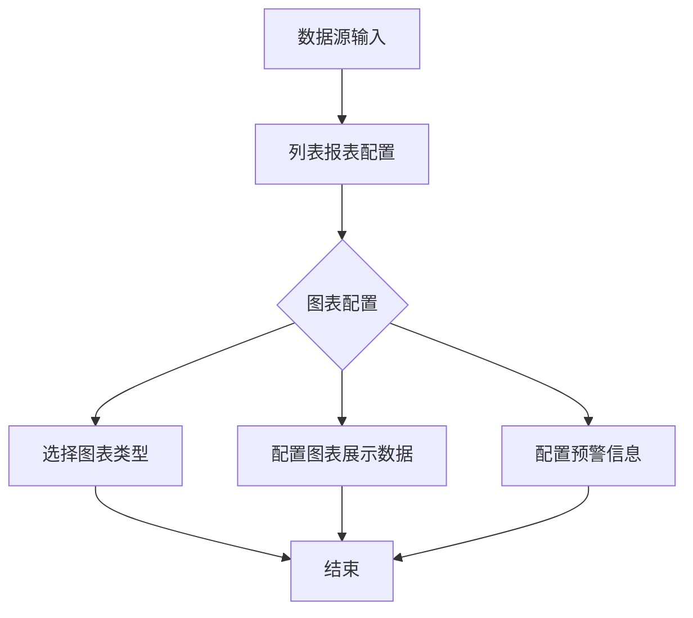

This work is open sourced under the Apache License, Version 2.0, using the
same license as the original [GitBook](https://github.com/GitbookIO/gitbook) repository.

Copyright 2019 Tao He.

[题目](https://leetcode-cn.com/problems/combine-two-tables/){:target="_blank"}