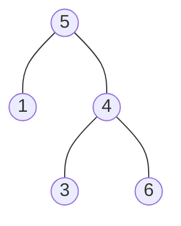

The jekyll-gitbook theme can be used just as other [Jekyll themes][1].

[Fork][2] this repository and add your markdown posts to the `_posts` folder, then
push to your own Github repository. No need to push generated HTML bundle.

[1]: https://pages.github.com/themes
[2]: https://github.com/sighingnow/jekyll-gitbook/fork