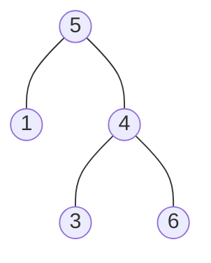

The jekyll-gitbook theme can be used just as other [Jekyll themes][1].

```sql
SELECT `id`,
       SUM(IF(`month` = 'Jan', `revenue`, NULL)) AS `Jan_Revenue`,
       SUM(IF(`month` = 'Feb', `revenue`, NULL)) AS `Feb_Revenue`,
       SUM(IF(`month` = 'Mar', `revenue`, NULL)) AS `Mar_Revenue`,
       SUM(IF(`month` = 'Apr', `revenue`, NULL)) AS `Apr_Revenue`,
       SUM(IF(`month` = 'May', `revenue`, NULL)) AS `May_Revenue`,
       SUM(IF(`month` = 'Jun', `revenue`, NULL)) AS `Jun_Revenue`,
       SUM(IF(`month` = 'Jul', `revenue`, NULL)) AS `Jul_Revenue`,
       SUM(IF(`month` = 'Aug', `revenue`, NULL)) AS `Aug_Revenue`,
       SUM(IF(`month` = 'Sep', `revenue`, NULL)) AS `Sep_Revenue`,
       SUM(IF(`month` = 'Oct', `revenue`, NULL)) AS `Oct_Revenue`,
       SUM(IF(`month` = 'Nov', `revenue`, NULL)) AS `Nov_Revenue`,
       SUM(IF(`month` = 'Dec', `revenue`, NULL)) AS `Dec_Revenue`
FROM `Department`
GROUP BY `id`
```

[Fork][2] this repository and add your markdown posts to the `_posts` folder, then
push to your own Github repository. No need to push generated HTML bundle.

```java
public int countSubstrings(String s) {
    int len = s.length();
    // 0表示未初始化 1表示是回文 2表示非回文
    int[][] dp = new int[len + 1][len + 1];
    for (int i = 0; i < len; i++) {
        dp[i][i] = 1;
    }

    BiFunction<Integer, Integer, Boolean> isPalindrome = (left, right) -> {
        int i = 0;
        int mid = (left + right) >> 1 - left;
        while (i < mid) {
            if (s.charAt(left + i) != s.charAt(right - i)) {
                return false;
            }
            i++;
        }

        return true;
    };
    
    // TODO

    for (int i = 0; i < len; i++) {

    }

    return 0;
}
```

[1]: https://pages.github.com/themes
[2]: https://github.com/sighingnow/jekyll-gitbook/fork